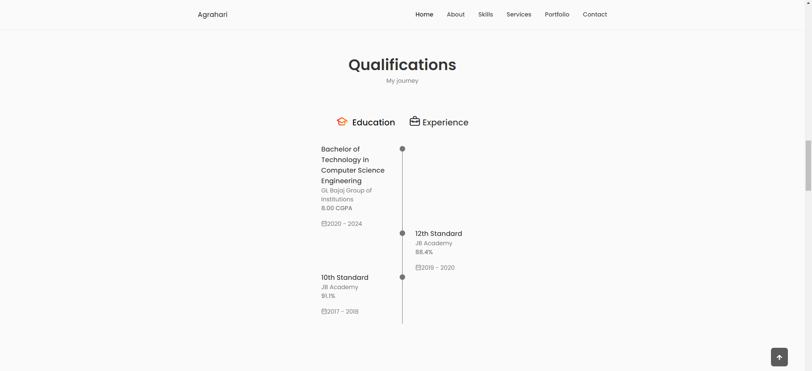

# Portfolio

## Description

This repository contains the source code for my personal portfolio website, showcasing my work, projects, and skills. Built using React, it features dynamically loaded content to ensure that updates to my work and skill sets are reflected in real time. The portfolio highlights my expertise in both frontend and backend development, as well as my design projects created using Adobe Illustrator and Figma.

## Features

- **Dynamic Content Loading:** Utilizes JSON files and the GitHub API to fetch and display project details and skills, making updates seamless.
- **Project Showcase:** Displays a variety of projects categorized into web, app, and design, each with links to live demos and repositories.
- **Skills Display:** Lists frontend and backend skills dynamically fetched from GitHub, ensuring the most current representation of my abilities.
- **Responsive Design:** Ensures optimal viewing experience on all devices, from desktops to mobile phones.

## Technologies Used

- **React:** For building the user interface.
- **GitHub API:** For fetching and displaying data dynamically.
- **HTML & CSS:** For structuring and styling the website.
- **JavaScript:** For interactivity and logic implementation.
- **Boxicons:** For accessing a wide range of icons.
- **Iconscout CDN:** For additional icons and resources.


## Snapshots


*Home*


*About*


*Expertise*


*Qualitfications*


*Portfolio*


*Endorsements*


*Ge in touch*


*Responsive view*


## Installation

To run this project locally:

1. Clone the repository:
   ```sh
   git clone https://github.com/yourusername/your-repo-name.git

2. Navigate to the project director.
   ```sh
   cd Portfolio

3. Install all dependencies:
   ```sh
   npm install

4. Run the react project.
   ```sh
   npm start
